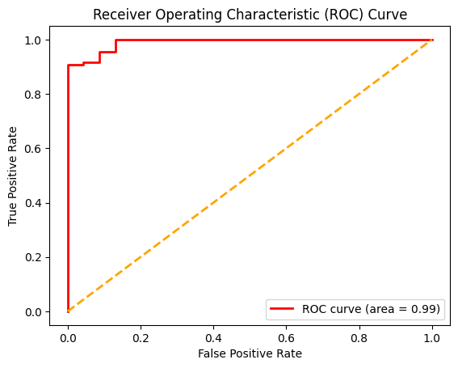
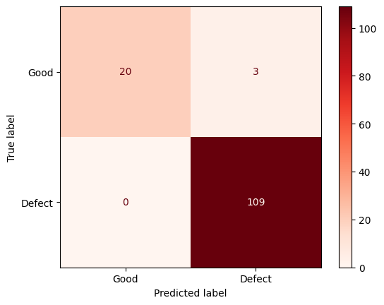
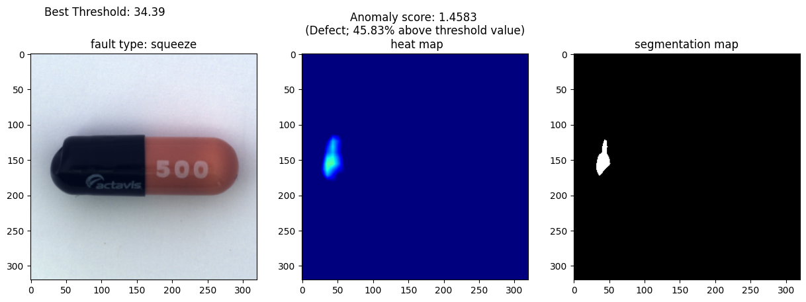

# Optimized PatchCore for Surface Anomaly Detection in Capsule Manufacturing

[Explore the Capsule Anomaly detection app on the Web 💊](https://optimized-capsule-manufacturing-defect-detection.streamlit.app/)

<p>

</p>


This project implements an optimized version of the PatchCore **(Roth et al., 2022)** anomaly detection framework for pharmaceutical quality control. By utilizing a ResNet50 backbone with weighted Layer-2 feature extraction and 320x320 spatial mapping for detecting complex capsule defects, the system achieves an AUROC score of 0.99 (99%) in detecting complex capsule defects.


## 📌 Project Overview

In industrial Quality Control, collecting a balanced dataset is difficult because defects are rare. This project addresses the "cold-start" problem by using the PatchCore framework to train exclusively on "good" samples (Unsupervised Learning). The model learns the distribution of normal capsule surfaces and flags any deviation as an anomaly, without ever seeing a defect during training phase.

## 🛠️ Tech Stack

* **Anomaly Detection Framework:** PyTorch, ResNet50
* **Language:** Python
* **Data/Image Processing:** NumPy, Pandas, OpenCV
* **Visualization and Performance Metrics:** Matplotlib, Scikit-Learn
* **Web Framework:** Streamlit
* **Development Environment:** Jupyter Notebook, VS Code, Google Colab


## 🔳 Key Features
* **Weighted Layer-2 Extraction:** Utilizes a pre-trained ResNet50 backbone, specifically extracting mid-level feature maps from Layer 2 to capture fine-grained surface textures.
* **High-Resolution Spatial Mapping:** Using 320x320 input resolution on the images in the dataset to ensure that complex defects which are often lost in lower resolutions, are preserved and localized.
* **Web Interface:** A user-friendly Streamlit app for real-time anomaly detection on uploaded images.
* **Visualization:** Includes Receiver Operating Characteristic (ROC) Curve, confusion matrix and Anomaly detection results.

## 📂 Dataset

The model is trained on the **[MVTec AD Dataset](https://www.mvtec.com/company/research/datasets/mvtec-ad/downloads)**.
* **Defect types:** 6 ("crack", "faulty imprint", "good", "poke", "scratch", "squeeze")
* **Training (Good only) Images:** 219 images.
* **Test Images:** 132 images.

## 📁 Repository Structure
<pre>
├── results_images
│   ├── anomaly_detection_results.png       # anomaly detection results
│   ├── confusion_matrix.png       # confusion matrix
│   ├── roc_curve.png        # roc curve
├── sample_images # test image batch for streamlit app
├── .gitignore
├── app__util.py # helper functions
├── capsule_defect_system.py # streamlit app
├── capsule_patchcore_assets.pt # memory bank
├── drug capsules.jpg # intro image
├── drug_capsule_patchcore.ipynb # jupyter notebook for feature extraction and testing the generated memory bank
├── LICENSE
├── README.md
└── requirements.txt       # project specific dependencies
</pre>

## 🚀 Getting Started

Follow these steps to set up the project locally.

### Prerequisites

**Python 3.8+**

### 1. Clone the Repository
```bash
git clone https://github.com/Oluwatobi-coder/Optimized-Capsule-Manufacturing-Defect-Detection-using-PatchCore-
cd Optimized-Capsule-Manufacturing-Defect-Detection-using-PatchCore-
```

### 2. Install Dependencies
```bash
pip install -r requirements.txt
```

## 🧠 CoreSet Sampling, Model Fitting and Testing

If you want to execute the training phase of the system and testing the memory bank against "unseen" data (defect images):

1. Open `drug_capsule_patchcore.ipynb` notebook.

2. Run the cells. The fitted model (memory bank) and the best threshold value for the dataset will be saved as a `tracapsule_patchcore_assets.pt` file.

**Note:** This system uses a frozen ResNet50 backbone for feature extraction. This means no weights are updated, making the "fitting" process computationally efficient. While GPU acceleration speeds up the initial CoreSet generation, the low sampling rate ensures that the resulting memory bank is lightweight enough for real-time CPU execution. Run on [Google Colab](https://colab.research.google.com/drive/1DYMjWw_u4cC5k-TLU6U6UYdUauumLELx?usp=sharing).

## 🌐 Running the Streamlit App
To interact with the model using the web interface locally:

1. Open the `capsule_defect_system.py` file:

2. Run the Streamlit command:
```bash
streamlit run capsule_defect_system.py
```
3. Use the pre-loaded images or upload from your device to get the anomaly results.

## 📊 Results

* **ROC Curve and Confusion Matrix:** visualized in the `drug_capsule_patchcore.ipynb` notebook and saved in `results_images` folder.

  <p align="center">
  
  
</p>

* **Anomaly Results:** visualized in the `drug_capsule_patchcore.ipynb` notebook in the `model_test_notebook` directory and saved in `results_images` folder.
  <p align="center">
  
</p>

## 🤝 Contributing

Contributions are welcome to help improve the detection accuracy or the efficiency of the memory bank:

* Fork the repository.

* Create a new branch (`git checkout -b feature-branch`).

* Commit your changes.

* Push to the branch and open a Pull Request.

## 📚 References

This project is built upon the following research:

Roth, K., Pemula, L., Zepeda, J., Bernhard, S., & Gehler, P. (2022). Towards Total Recall in Industrial Anomaly Detection. Proceedings of the IEEE/CVF Conference on Computer Vision and Pattern Recognition (CVPR). [Read Paper](https://arxiv.org/abs/2106.08265)

## 📜 License

This project is licensed under the MIT License - see the `LICENSE file` for details.

## 
If you find this implementation helpful, please ⭐ the repository!

